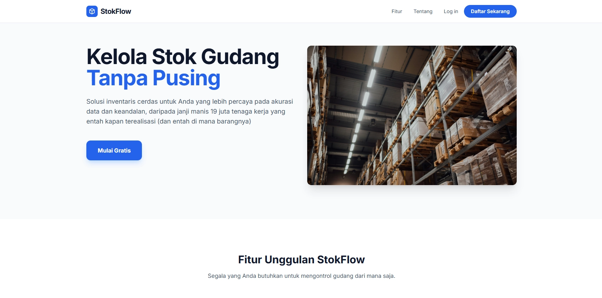

# 📦 Warehouse Stock Management System



Sistem Manajemen Stok Gudang berbasis web yang dirancang untuk membantu organisasi dalam mengelola **item, stok, transaksi stok, gudang, dan pengguna** secara terstruktur, aman, dan berbasis **Role-Based Access Control (RBAC)**.

Aplikasi ini cocok digunakan untuk kebutuhan **akademik, UMKM, maupun internal perusahaan** yang membutuhkan pengelolaan stok gudang yang rapi dan terdokumentasi.

---

## 🚀 Fitur Unggulan

### 🔐 Role-Based Access Control (RBAC)

Hak akses dibatasi berdasarkan peran pengguna:

- **Owner**: Manajemen penuh termasuk user management
- **Admin**: Manajemen data operasional
- **Supervisor**: Monitoring dan laporan
- **Staff**: Operasional transaksi stok

### 📊 Manajemen Stok Terintegrasi

- Manajemen **Item & Kategori**
- Manajemen **Gudang (Warehouse)**
- Manajemen **Stok per Gudang**
- Pencatatan **Transaksi Stok (IN / OUT)**

### 📈 Laporan & Export Data

- Download laporan dalam format **Spreadsheet (Excel)**
- Laporan tersedia untuk:
  - Items
  - Stocks
  - Stock Transactions

- Hak akses laporan dibatasi (Owner, Admin, Supervisor)

### 🧾 Audit & Monitoring

- Riwayat transaksi stok tercatat rapi
- Relasi data jelas (item, gudang, user)

---

## 👥 Role & Hak Akses

| Role       | Hak Akses Utama                                    |
| ---------- | -------------------------------------------------- |
| Owner      | CRUD semua data + Manajemen User                   |
| Admin      | CRUD Category, Warehouse, Item, Stock, Transaction |
| Supervisor | Read Item, Stock, Transaction + Download Report    |
| Staff      | Read Item & Stock, Create Transaction              |

---

## 🛠️ Teknologi yang Digunakan

### Backend

- **Laravel** (PHP Framework)
- **MySQL** (Relational Database)
- **Eloquent ORM**
- **Middleware RBAC**

### Library Tambahan

- **phpoffice/phpspreadsheet** – Export laporan Excel

### Frontend

- **Blade Template Engine**
- UI sepenuhnya fleksibel & customizable
- Tailwindcss

---

## ⚙️ Instalasi & Setup

### 1️⃣ Clone Repository

```bash
git clone https://github.com/ariefdrm/warehouse_stocks_laravel.git
cd warehouse_stocks_laravel
```

### 2️⃣ Install Dependency And Build Dependency

```bash
composer install
npm install
npm run build
```

### 3️⃣ Konfigurasi Environment

```bash
cp .env.example .env
php artisan key:generate
```

Sesuaikan konfigurasi database pada file `.env`:

```env
DB_DATABASE=warehouse_stocks
DB_USERNAME=root
DB_PASSWORD=
```

### 4️⃣ Migrasi & Seeder

```bash
php artisan migrate --seed
```

### 5️⃣ Jalankan Aplikasi

```bash
php artisan serve
```

Akses melalui browser:

```
http://localhost:8000
```

---

## 🔑 Akun Default (Seeder)

| Role       | Email                                                   | Password |
| ---------- | ------------------------------------------------------- | -------- |
| Owner      | [owner@example.com](mailto:owner@example.com)           | password |
| Admin      | [admin@example.com](mailto:admin@example.com)           | password |
| Supervisor | [supervisor@example.com](mailto:supervisor@example.com) | password |
| Staff      | [staff@example.com](mailto:staff@example.com)           | password |

> **Catatan:** Segera ubah password setelah login pertama.

---

## 📁 Struktur Modul Utama

```
app/
 ├── Models/
 │   ├── Category.php
 │   ├── Items.php
 │   ├── Roles.php
 │   ├── StockTransaction.php
 │   ├── Stocks.php
 │   └── User.php
 ├── Http/
 │   ├── Controllers/
 │   ├── Middleware/
```

---

## 📌 Catatan Pengembangan

- Sistem dirancang modular dan mudah dikembangkan
- Mendukung penambahan role & permission baru
- Cocok untuk pengembangan lanjutan seperti:
  - Dashboard analytics
  - Notifikasi stok minimum
  - REST API

---

## 📄 Lisensi

Proyek ini dibuat untuk keperluan pembelajaran dan pengembangan internal. Silakan disesuaikan dengan kebutuhan masing-masing.

Dilisensikan di bawah [MIT License](LICENSE). Lihat file LICENSE untuk detail lengkap.

---

## ✨ Penutup

Warehouse Stock Management System memberikan solusi **sederhana, terstruktur, dan aman** untuk pengelolaan stok gudang berbasis web dengan kontrol akses yang jelas.

Jika Anda ingin mengembangkan fitur lanjutan atau membutuhkan dokumentasi tambahan (Use Case, ERD, API Docs), sistem ini sudah siap sebagai fondasi yang kuat.
